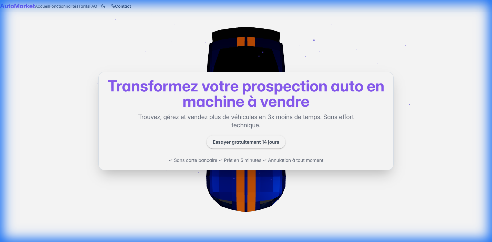

# AutoMarket 3D Landing Page

A modern, immersive 3D landing page for AutoMarket featuring a low-poly car model, smooth camera animations, and mobile-first design.



## 🚀 Features

- **3D Low-Poly Car Model**: Custom-built car with optimized geometry.
- **Smooth Camera Transitions**: Cinematic angles corresponding to content sections.
- **Mobile-First Design**: Touch gestures, optimized performance, and responsive layout.
- **Urban Environment**: Stylized street scene with neon lighting.
- **Interactive Navigation**: Scroll, swipe, keyboard, and dot navigation.

## 🛠️ Tech Stack

- **React Three Fiber**: For declarative 3D scenes.
- **Tailwind CSS**: For styling and responsive design.
- **Framer Motion**: For smooth UI animations.
- **Vite**: For fast development and building.

## 📦 Quick Start

```bash
# Install dependencies
npm install

# Start development server
npm run dev

# Build for production
npm run build
```

## 📄 License

MIT License